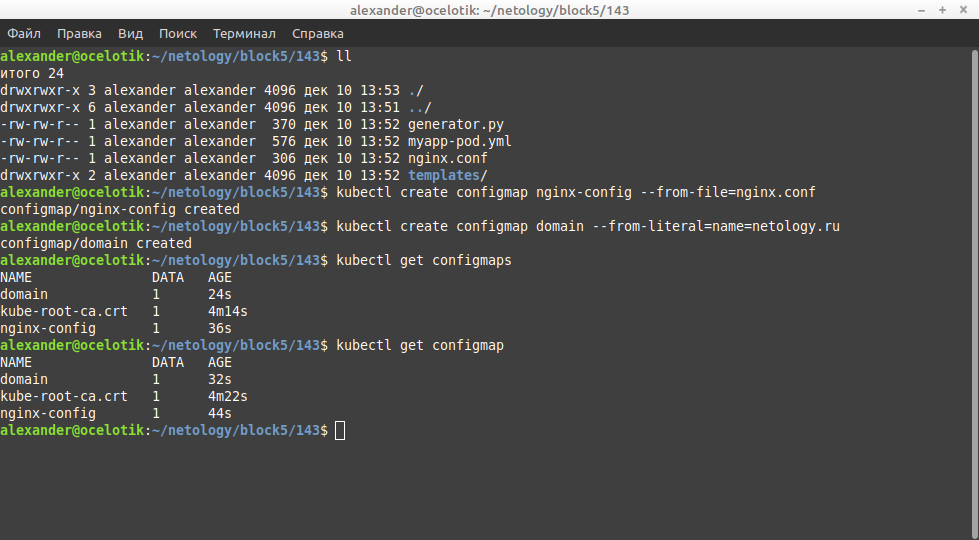

# Домашнее задание к занятию "14.3 Карты конфигураций"

## Задача 1: Работа с картами конфигураций через утилиту kubectl в установленном minikube

Выполните приведённые команды в консоли. Получите вывод команд. Сохраните
задачу 1 как справочный материал.

### Как создать карту конфигураций? Как просмотреть список карт конфигураций?

```
kubectl create configmap nginx-config --from-file=nginx.conf
kubectl create configmap domain --from-literal=name=netology.ru
```
```
kubectl get configmaps
kubectl get configmap
```
### Ответ.
 


### Как просмотреть карту конфигурации?

```
kubectl get configmap nginx-config
kubectl describe configmap domain
```
### Ответ.


### Как получить информацию в формате YAML и/или JSON?

```
kubectl get configmap nginx-config -o yaml
kubectl get configmap domain -o json
```
### Ответ.


### Как выгрузить карту конфигурации и сохранить его в файл?

```
kubectl get configmaps -o json > configmaps.json
kubectl get configmap nginx-config -o yaml > nginx-config.yml
```

### Ответ.


### Как удалить карту конфигурации?

```
kubectl delete configmap nginx-config
```

### Ответ.


### Как загрузить карту конфигурации из файла?

```
kubectl apply -f nginx-config.yml
```
### Ответ.


---

### Как оформить ДЗ?

Выполненное домашнее задание пришлите ссылкой на .md-файл в вашем репозитории.

---

https://github.com/AlexanderSpitsyn07/kubercloud/tree/master/DZconfmap

---


