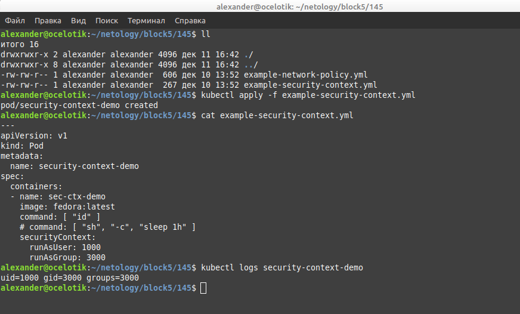

# Домашнее задание к занятию "14.5 SecurityContext, NetworkPolicies"

## Задача 1: Рассмотрите пример 14.5/example-security-context.yml

Создайте модуль

```
kubectl apply -f 14.5/example-security-context.yml
```

Проверьте установленные настройки внутри контейнера

```
kubectl logs security-context-demo
uid=1000 gid=3000 groups=3000
```



---

### Как оформить ДЗ?

Выполненное домашнее задание пришлите ссылкой на .md-файл в вашем репозитории.

https://github.com/AlexanderSpitsyn07/kubercloud/tree/master/DZscnp
---

