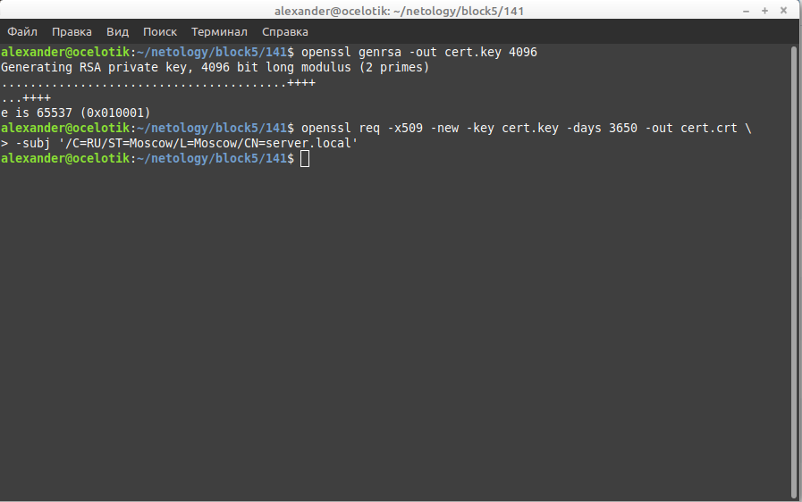
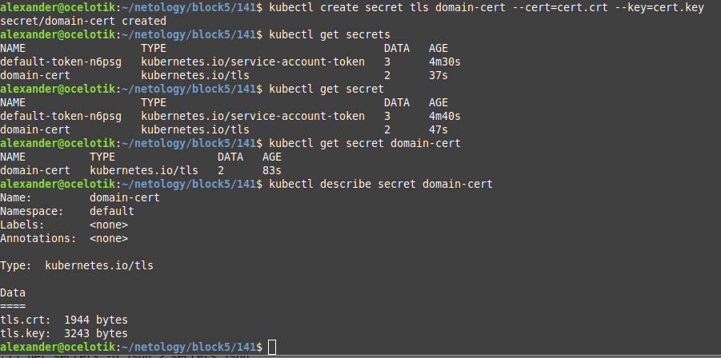
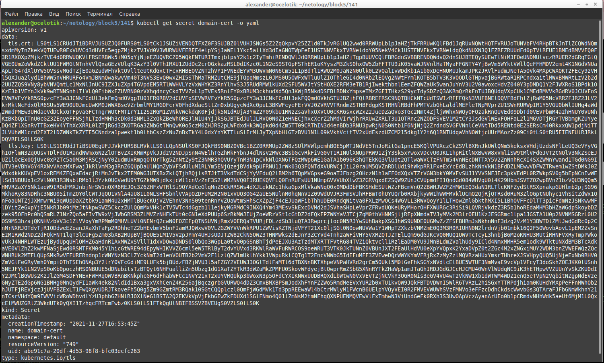
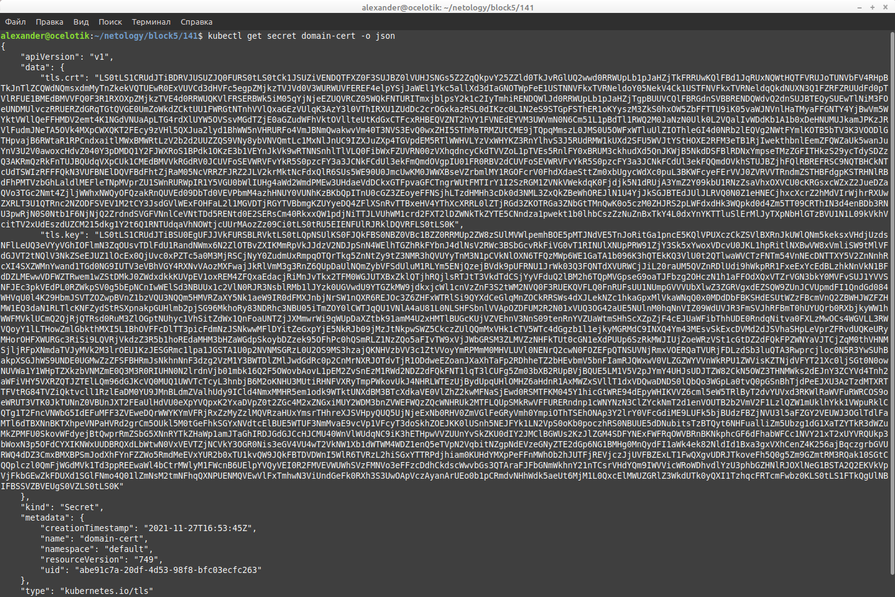
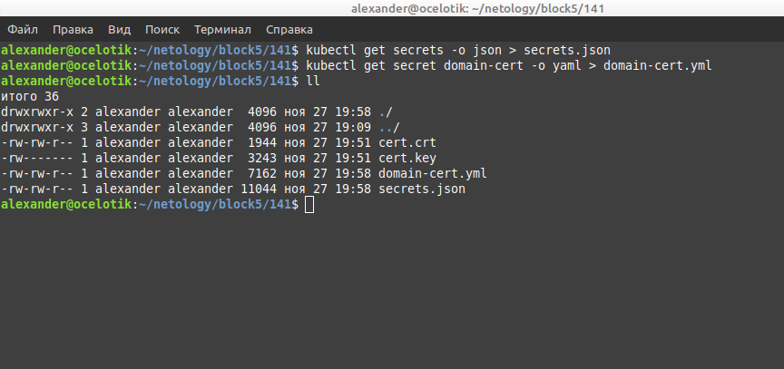
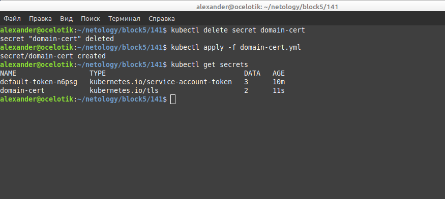

# Домашнее задание к занятию "14.1 Создание и использование секретов"

## Задача 1: Работа с секретами через утилиту kubectl в установленном minikube

Выполните приведённые ниже команды в консоли, получите вывод команд. Сохраните
задачу 1 как справочный материал.

### Как создать секрет?
### Как просмотреть список секретов?
### Как просмотреть секрет?

### Как получить информацию в формате YAML и/или JSON?

### Как выгрузить секрет и сохранить его в файл?

### Как удалить секрет?
### Как загрузить секрет из файла?

