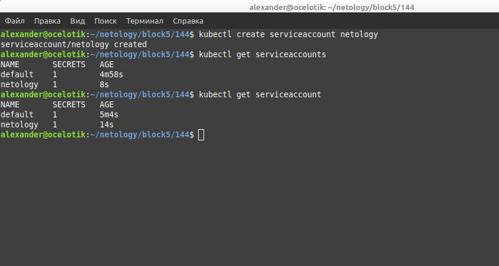
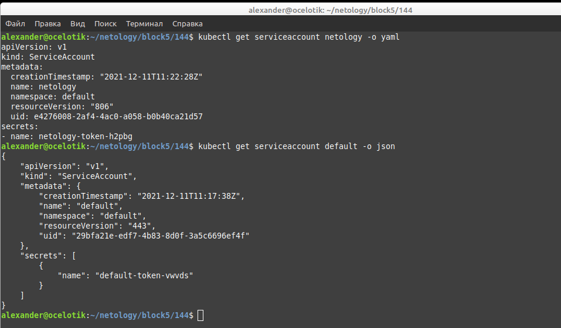
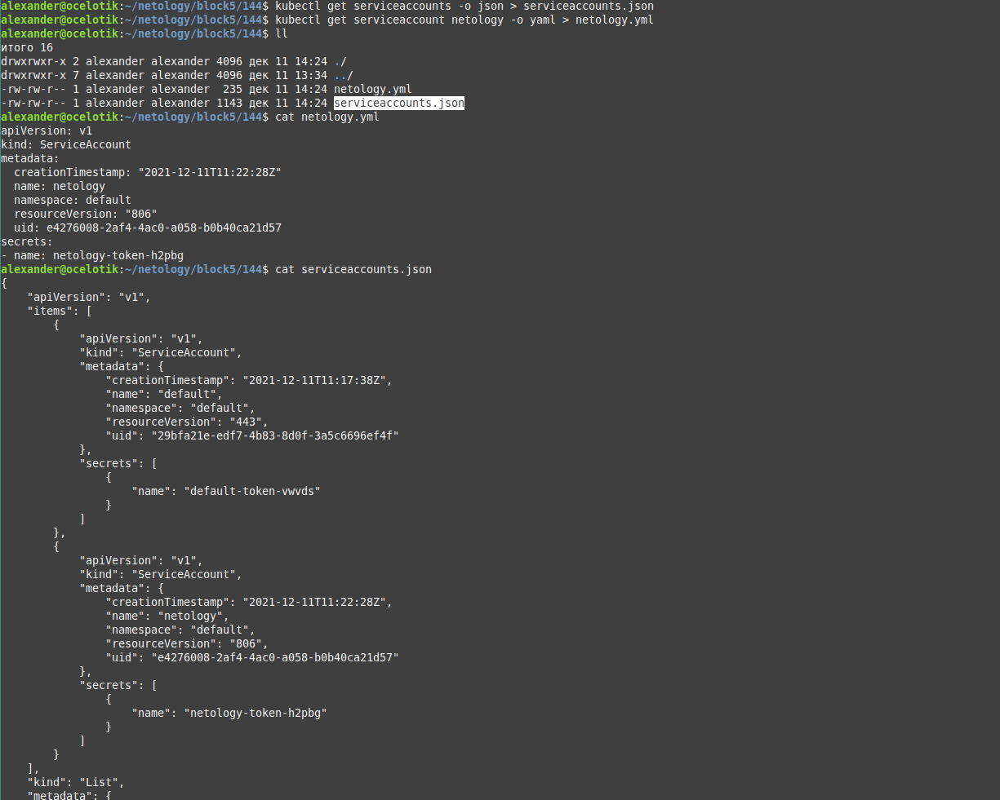
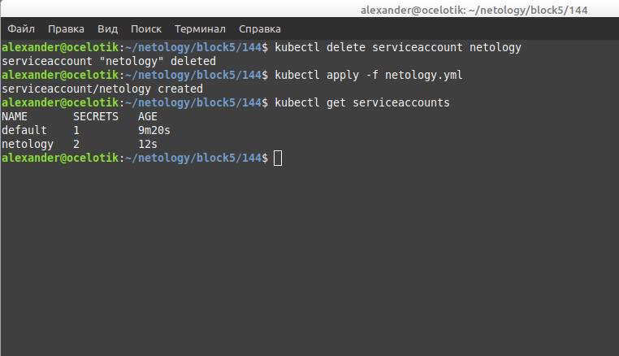
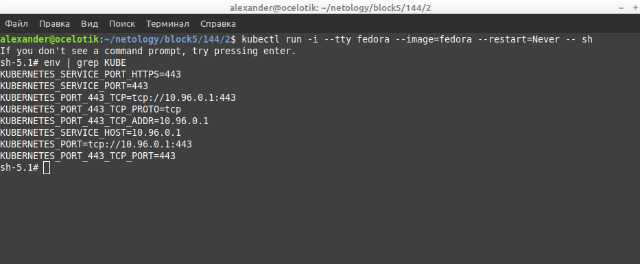
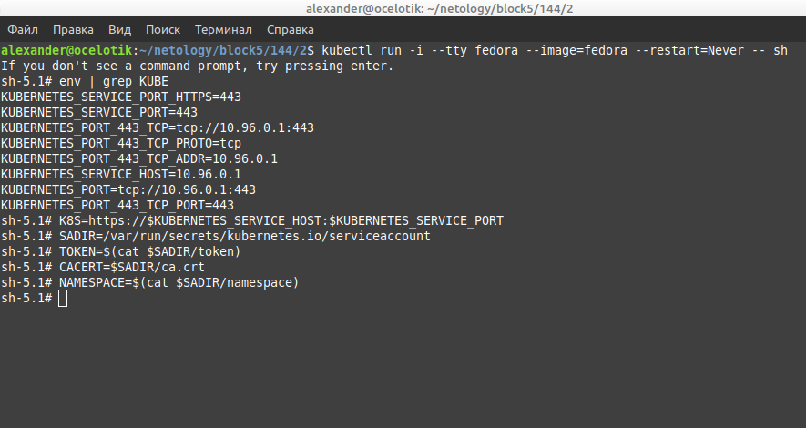
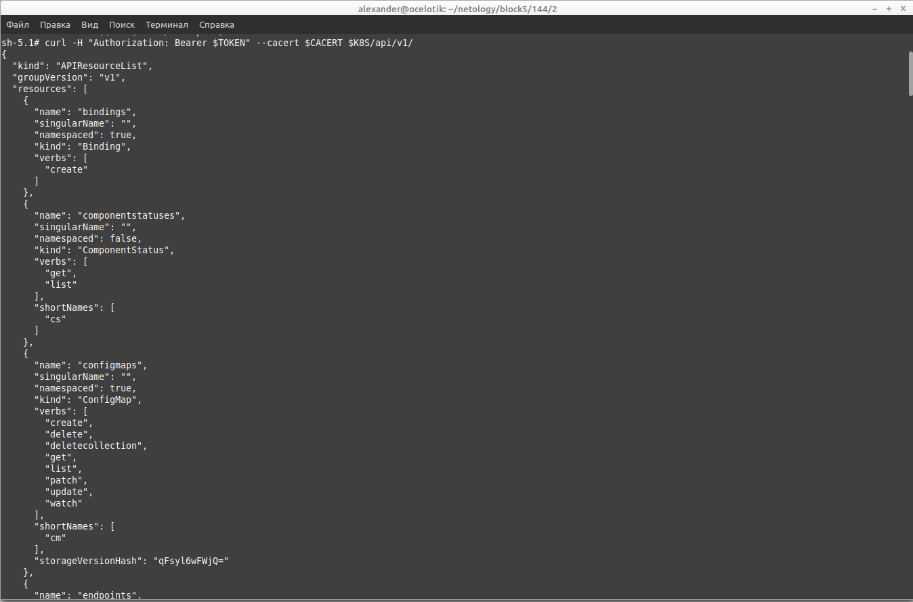

# Домашнее задание к занятию "14.4 Сервис-аккаунты"

## Задача 1: Работа с сервис-аккаунтами через утилиту kubectl в установленном minikube

Выполните приведённые команды в консоли. Получите вывод команд. Сохраните
задачу 1 как справочный материал.

### Как создать сервис-аккаунт? Как просмотреть список сервис-акаунтов?

```
kubectl create serviceaccount netology
kubectl get serviceaccounts
kubectl get serviceaccount
```
### Ответ.



### Как получить информацию в формате YAML и/или JSON?

```
kubectl get serviceaccount netology -o yaml
kubectl get serviceaccount default -o json
```
### Ответ.



### Как выгрузить сервис-акаунты и сохранить его в файл?

```
kubectl get serviceaccounts -o json > serviceaccounts.json
kubectl get serviceaccount netology -o yaml > netology.yml
```
### Ответ.



### Как удалить сервис-акаунт? Как загрузить сервис-акаунт из файла?

```
kubectl delete serviceaccount netology
kubectl apply -f netology.yml
```
### Ответ.



## Задача 2 (*): Работа с сервис-акаунтами внутри модуля

Выбрать любимый образ контейнера, подключить сервис-акаунты и проверить
доступность API Kubernetes. Просмотреть переменные среды.

```
kubectl run -i --tty fedora --image=fedora --restart=Never -- sh
env | grep KUBE

```


Получить значения переменных

```
K8S=https://$KUBERNETES_SERVICE_HOST:$KUBERNETES_SERVICE_PORT
SADIR=/var/run/secrets/kubernetes.io/serviceaccount
TOKEN=$(cat $SADIR/token)
CACERT=$SADIR/ca.crt
NAMESPACE=$(cat $SADIR/namespace)
```


Подключаемся к API

```
curl -H "Authorization: Bearer $TOKEN" --cacert $CACERT $K8S/api/v1/
```


---

### Как оформить ДЗ?

Выполненное домашнее задание пришлите ссылкой на .md-файл в вашем репозитории.

---


---


