# Домашнее задание к занятию 15.2 "Вычислительные мощности. Балансировщики нагрузки".

## Задание 1. Яндекс.Облако (обязательное к выполнению)

1. Создать bucket Object Storage и разместить там файл с картинкой:
- Создать bucket в Object Storage с произвольным именем (например, _имя_студента_дата_);
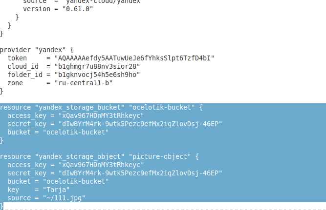

- Положить в bucket файл с картинкой;
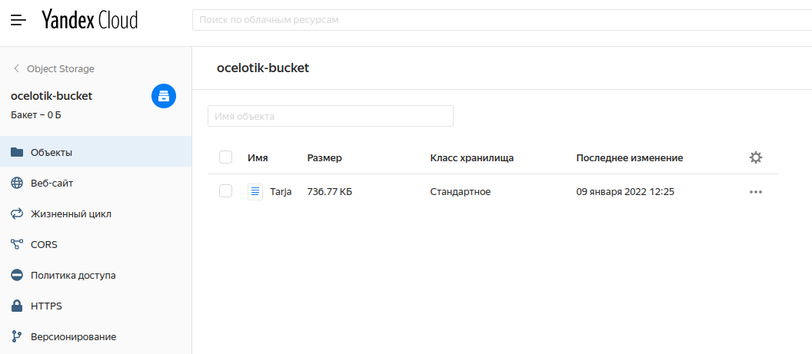

- Сделать файл доступным из Интернет.
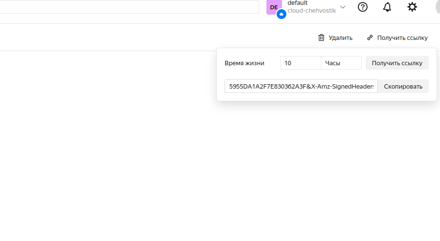

2. Создать группу ВМ в public подсети фиксированного размера с шаблоном LAMP и web-страничкой, содержащей ссылку на картинку из bucket:
- Создать Instance Group с 3 ВМ и шаблоном LAMP. Для LAMP рекомендуется использовать `image_id = fd827b91d99psvq5fjit`;
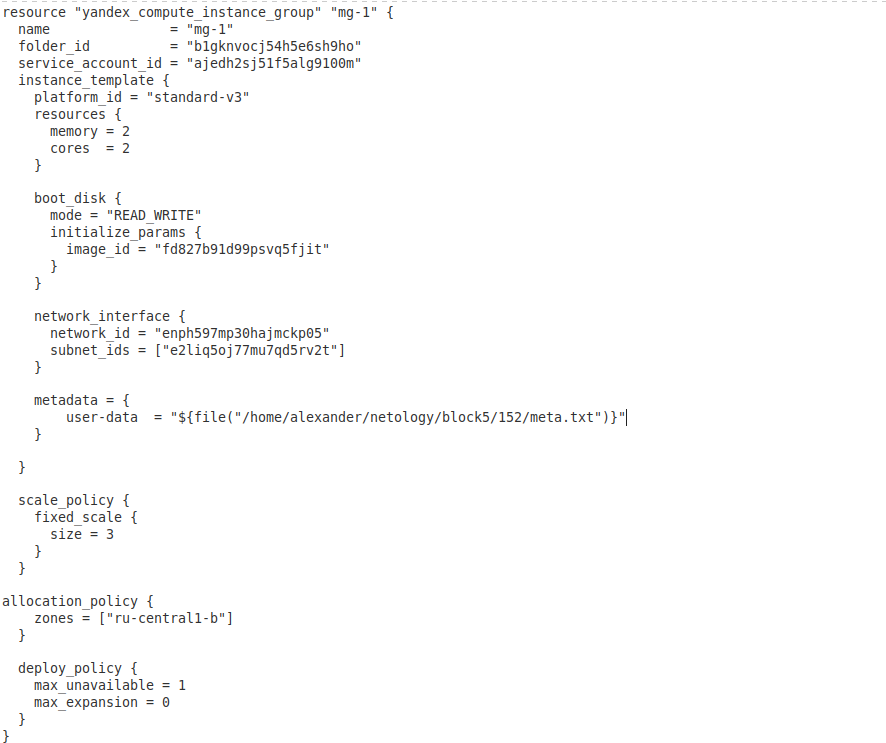
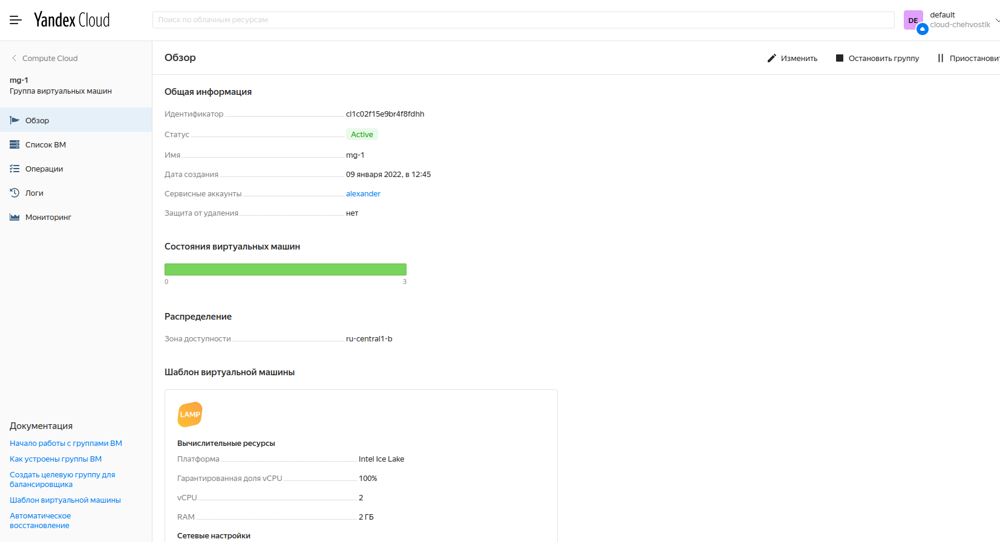

- Для создания стартовой веб-страницы рекомендуется использовать раздел `user_data` в [meta_data];
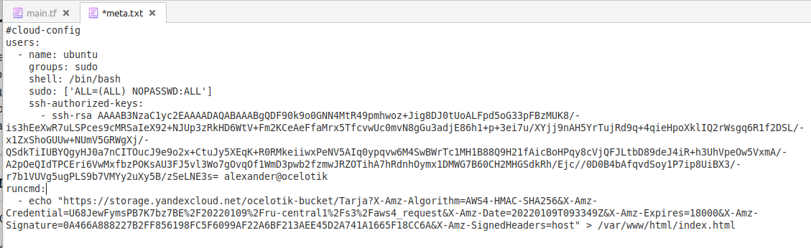

- Разместить в стартовой веб-странице шаблонной ВМ ссылку на картинку из bucket;
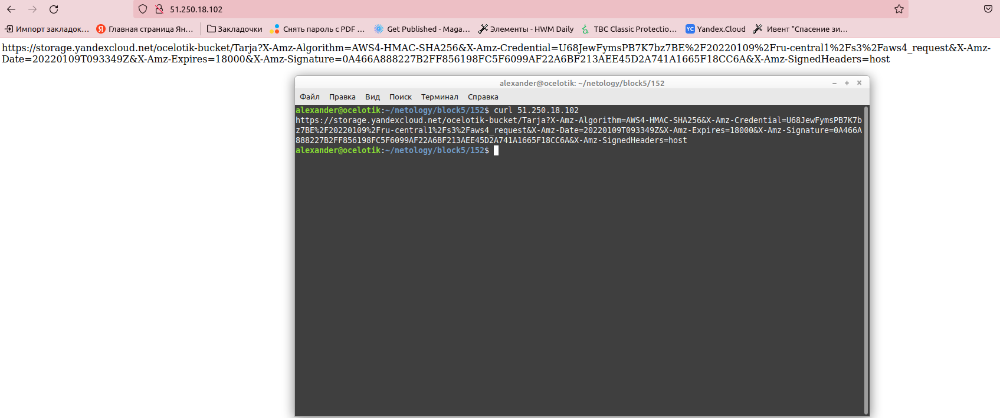

- Настроить проверку состояния ВМ.
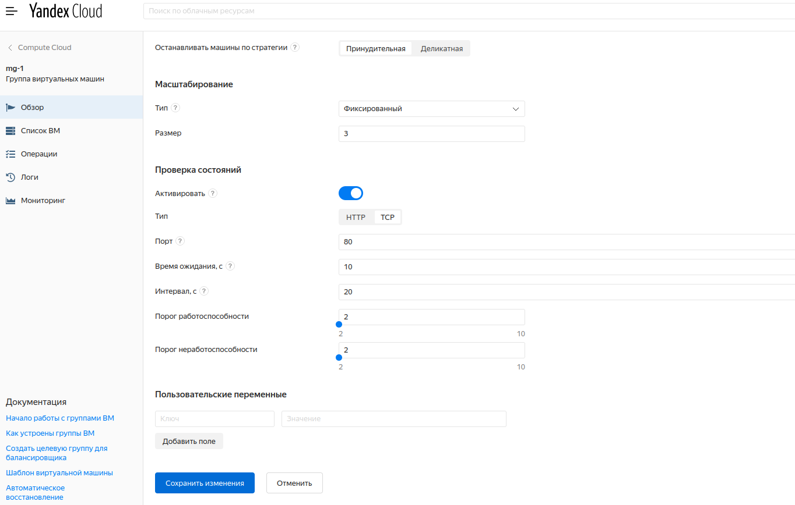

3. Подключить группу к сетевому балансировщику:
- Создать сетевой балансировщик;
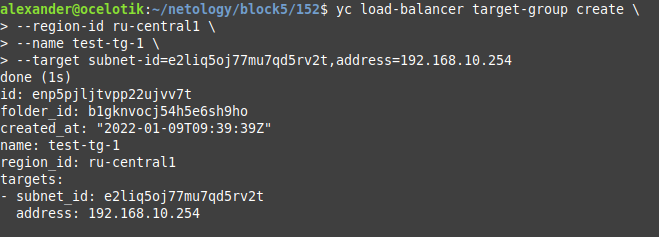
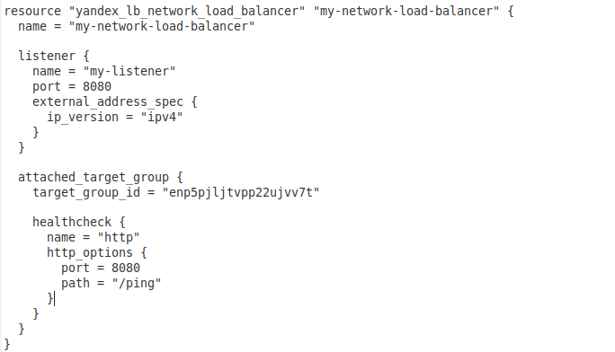
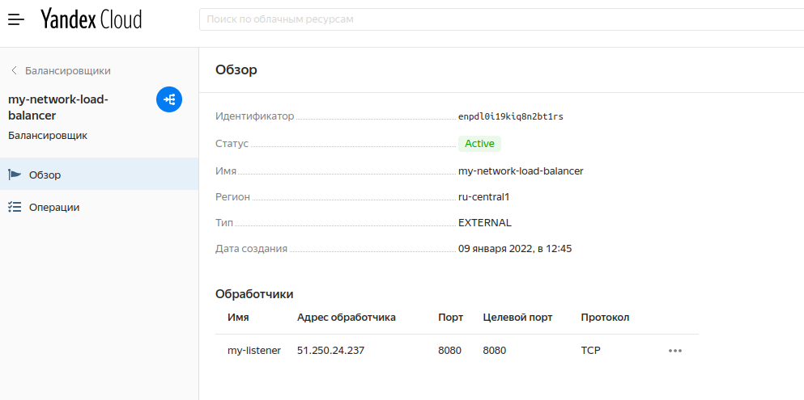

- Проверить работоспособность, удалив одну или несколько ВМ.
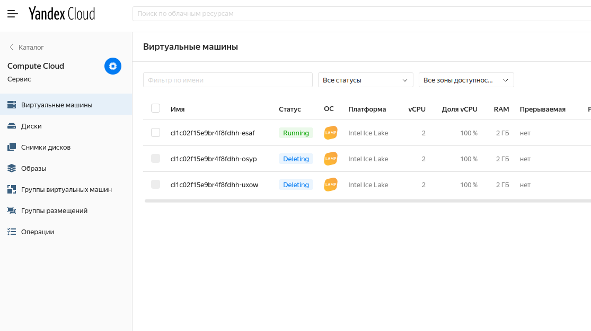
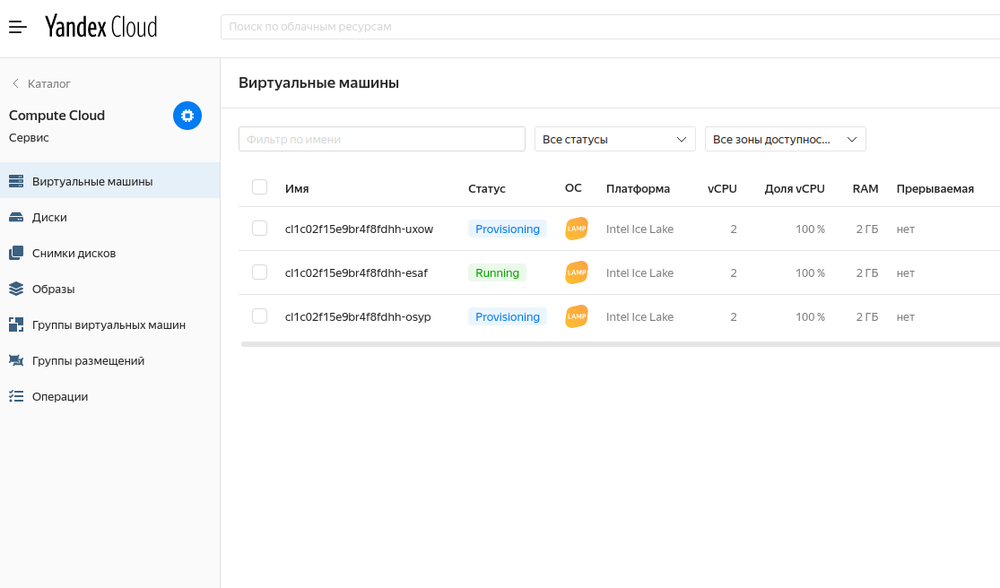
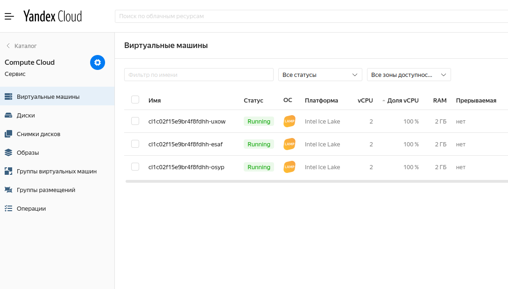

---

Рядом со скриншотами и этим файлом находятся файлы main.tf и meta.txt (вырезки из которых сделаны также скриншотами) с моей конфигурацией терраформ, через который выполнялось ДЗ.

