# Домашнее задание к занятию "15.1. Организация сети"

Домашнее задание будет состоять из обязательной части, которую необходимо выполнить на провайдере Яндекс.Облако и дополнительной части в AWS по желанию. Все домашние задания в 15 блоке связаны друг с другом и в конце представляют пример законченной инфраструктуры. 
Все задания требуется выполнить с помощью Terraform, результатом выполненного домашнего задания будет код в репозитории. 

Перед началом работ следует настроить доступ до облачных ресурсов из Terraform используя материалы прошлых лекций и [ДЗ](https://github.com/netology-code/virt-homeworks/tree/master/07-terraform-02-syntax ). А также заранее выбрать регион (в случае AWS) и зону.

---
## Задание 1. Яндекс.Облако (обязательное к выполнению)

1. Создать VPC.
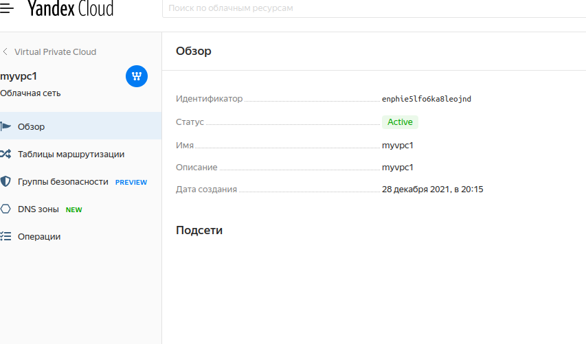
- Создать пустую VPC. Выбрать зону.
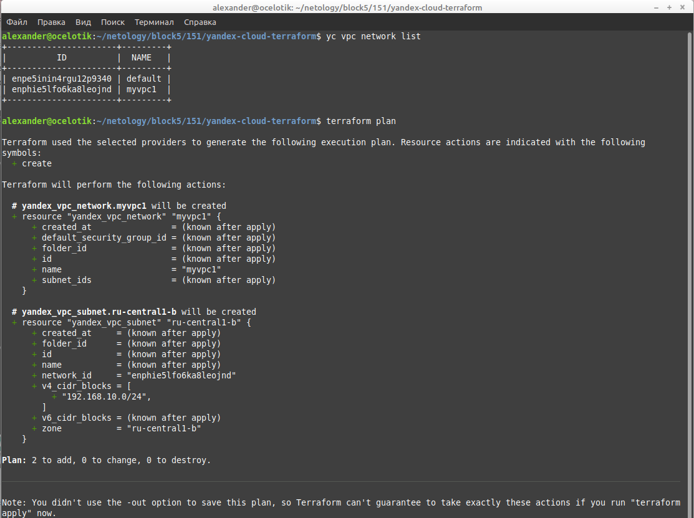
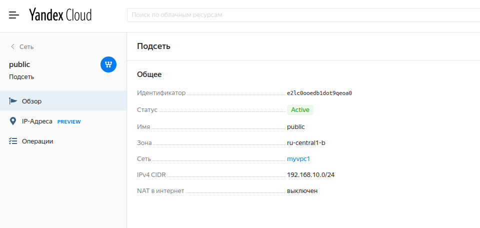

2. Публичная подсеть.
- Создать в vpc subnet с названием public, сетью 192.168.10.0/24.
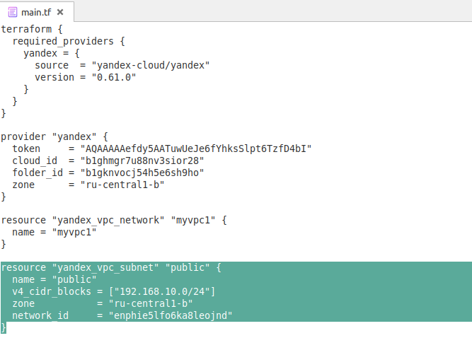

- Создать в этой подсети NAT-инстанс, присвоив ему адрес 192.168.10.254. В качестве image_id использовать fd80mrhj8fl2oe87o4e1
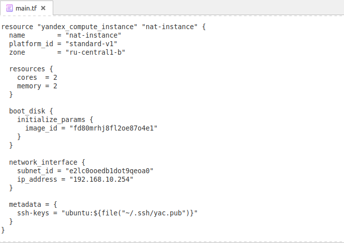
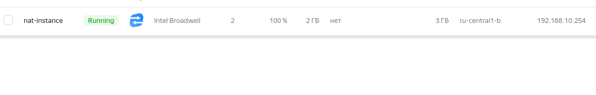
- Создать в этой публичной подсети виртуалку с публичным IP и подключиться к ней, убедиться что есть доступ к интернету.
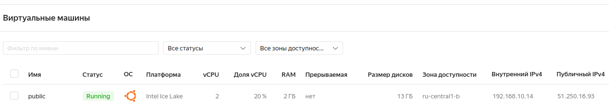
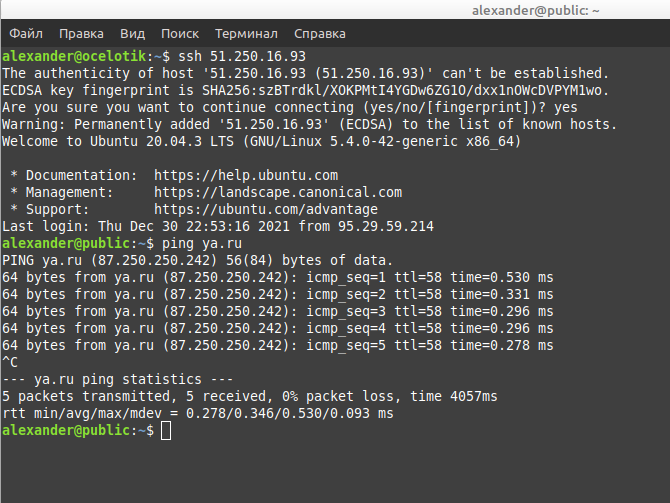
3. Приватная подсеть.
- Создать в vpc subnet с названием private, сетью 192.168.20.0/24.
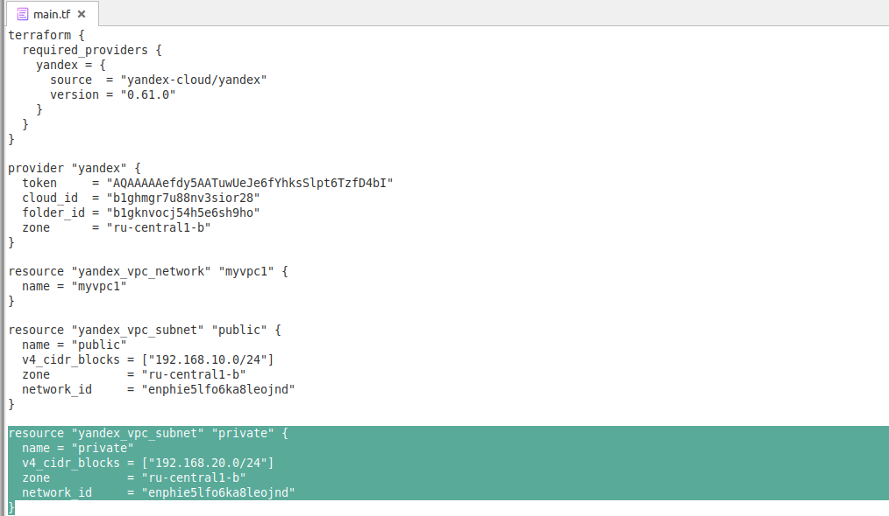
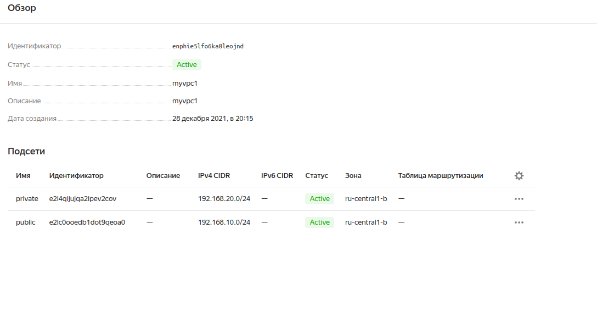
- Создать route table. Добавить статический маршрут, направляющий весь исходящий трафик private сети в NAT-инстанс
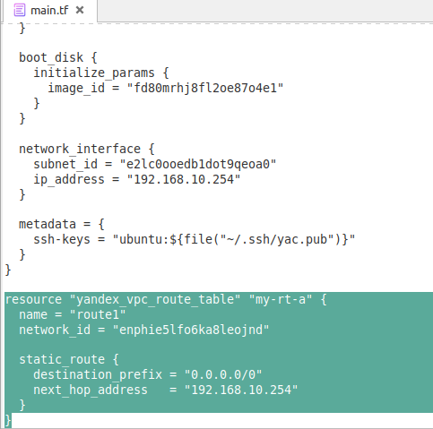
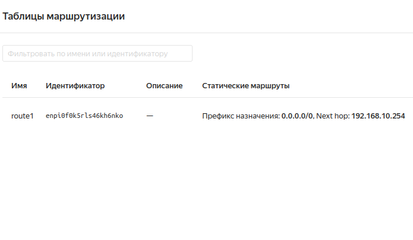
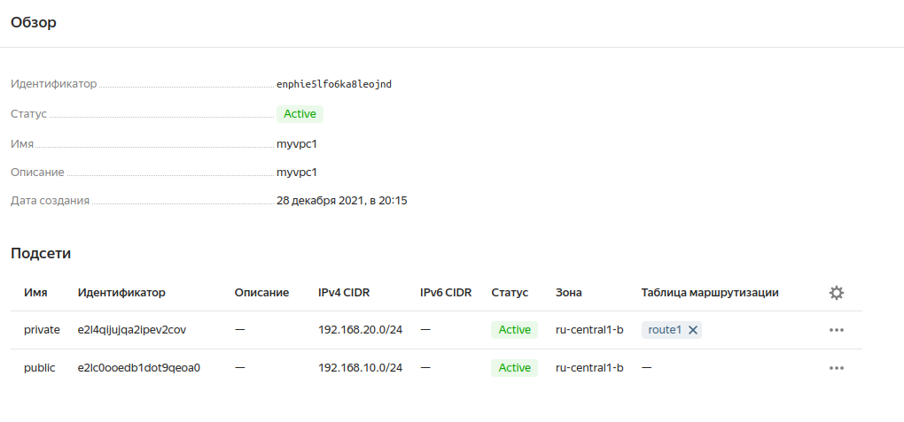
- Создать в этой приватной подсети виртуалку с внутренним IP, подключиться к ней через виртуалку, созданную ранее и убедиться что есть доступ к интернету
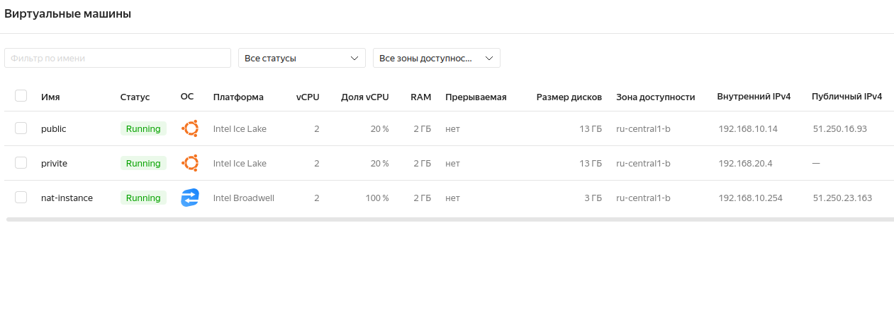
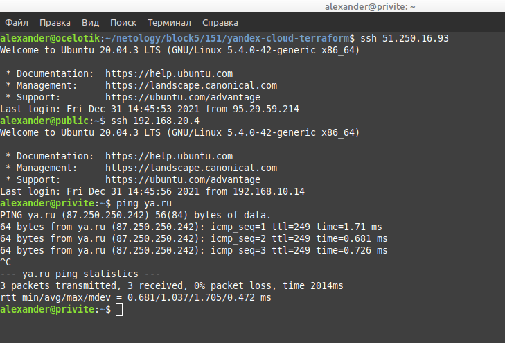

---

Рядом со скриншотами и этим файлом находится файл maint.tf с моей конфигурацией терраформ, через который выполнялось ДЗ.

